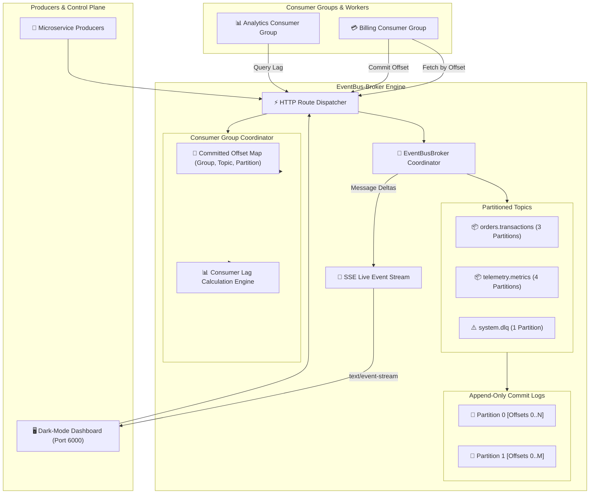

# ⚡ EventBus-Broker
> **Distributed Partitioned Pub/Sub Event Streaming Broker with Offset Commits & Consumer Groups**  
> *Developed autonomously by the 7-Agent SDLC Software Factory for [Ali Nurettin Demir](https://github.com/alinurettin)*

[]()
[-success.svg)]()
[]()
[]()
[](https://opensource.org/licenses/MIT)

---

## 🌟 Executive Summary & Value Proposition
Asynchronous event streaming is the lifeblood of decoupled microservices and reactive systems. However, deploying enterprise platforms like Apache Kafka or RabbitMQ requires extensive resource provisioning, JVM tuning, and cluster coordination overhead.

**EventBus-Broker** is a lightweight, zero-dependency partitioned event streaming broker crafted from first principles in pure Node.js. It delivers append-only partitioned commit logs, deterministic key-based partition hashing, consumer group offset commits, real-time consumer lag metrics, changelog compaction, and AMQP/MQTT hierarchical topic filtering.

---

## 🏗️ System Architecture & Data Flow



---

## 🔬 Mathematical & Storage Formulations

### 1. Deterministic Partition Key Hashing
To preserve strict FIFO sequencing for an entity key across partitions:
$$\text{hash}_{32}(\text{Key}) = \text{MD5}(\text{Key})[0..3]_{32}$$
$$\text{PartitionID} = \text{hash}_{32}(\text{Key}) \pmod N$$
Guarantees all events for an entity land on the same partition in sequential order.

### 2. Consumer Group Lag Calculation
$$\text{Lag}(G, T, p) = \max(0, \text{HighWatermark}(T, p) - \text{CommittedOffset}(G, T, p))$$
$$\text{TotalLag}(G, T) = \sum_{p=0}^{N-1} \text{Lag}(G, T, p)$$

### 3. Topic Log Compaction
Reduces storage from $O(M)$ historical transitions to $O(U)$ latest key states:
$$\mathcal{L}_{\text{compacted}} = \{ m_k \mid m_k = \arg\max_{m.key = k} m.\text{offset} \}$$

---

## 🔌 API Specification & REST Endpoints

| Method | Endpoint | Description |
|---|---|---|
| `GET` | `/api/health` | Health status, uptime, and version |
| `GET` | `/api/stats` | Broker telemetry, topic counts, and messages |
| `GET` | `/api/topics` | List registered topics and partition summaries |
| `POST` | `/api/topics` | Create new topic with custom partition count |
| `POST` | `/api/publish` | Publish message frame `{ topic, key, value, headers }` |
| `GET` | `/api/fetch` | Fetch messages by `topic`, `partition`, `offset`, `limit` |
| `POST` | `/api/groups/commit` | Commit consumer group progress for a partition |
| `GET` | `/api/groups/lag` | Query real-time consumer group lag metrics |
| `GET` | `/api/events/stream` | Server-Sent Events (SSE) live broadcast stream |

### Message Publish Example
```bash
curl -X POST http://localhost:6000/api/publish \
  -H "Content-Type: application/json" \
  -d '{
    "topic": "orders.transactions",
    "key": "cust_84920",
    "value": {
      "orderId": "ord_9941",
      "amount": 149.50,
      "status": "COMPLETED"
    }
  }'
```

---

## 🧪 Comprehensive Automated Testing & Verification
The test suite in `tests/run_tests.js` runs without external mocking libraries:

```bash
node tests/run_tests.js
```

### Verified Test Categories:
- **Append-Only Partition Log (4 assertions):** Monotonic offsets, high watermarks, window slice fetching, and key compaction.
- **Multi-Partition Topic Hashing (3 assertions):** Multi-partition creation, deterministic key routing, and aggregate count.
- **Consumer Group Lag & Offsets (2 assertions):** Committed offset persistence and accurate lag calculation.
- **Hierarchical Topic Pattern Matching (2 assertions):** Single-level (`*`) and multi-level (`#`) matching.
- **Live Ephemeral HTTP Gateway (10 assertions):** Full ephemeral port 0 REST and SSE integration.

---

## 🚀 Getting Started

### Local Node.js Execution
```bash
# 1. Clone repository
git clone https://github.com/alinurettin/EventBus-Broker.git
cd EventBus-Broker

# 2. Run automated test suite
npm test

# 3. Start engine
npm start
```
Open **`http://localhost:6000`** in your browser to access the live dashboard.

### Docker & Docker Compose
```bash
docker-compose up -d --build
```

---

## 📄 Artifacts & Documentation
- [Research Report](file:///C:/Users/alinurettin/.gemini/antigravity/scratch/projects/EventBus-Broker/artifacts/RESEARCH_REPORT.md)
- [Product Requirements Document (PRD)](file:///C:/Users/alinurettin/.gemini/antigravity/scratch/projects/EventBus-Broker/artifacts/PRD.md)
- [Architecture Blueprint](file:///C:/Users/alinurettin/.gemini/antigravity/scratch/projects/EventBus-Broker/artifacts/ARCHITECTURE.md)
- [QA & Verification Report](file:///C:/Users/alinurettin/.gemini/antigravity/scratch/projects/EventBus-Broker/artifacts/QA_REPORT.md)
- [Release Notes](file:///C:/Users/alinurettin/.gemini/antigravity/scratch/projects/EventBus-Broker/artifacts/RELEASE_NOTES.md)

---

## 📜 License
MIT License. Engineered autonomously by the 7-Agent SDLC Software Factory for Ali Nurettin Demir.
