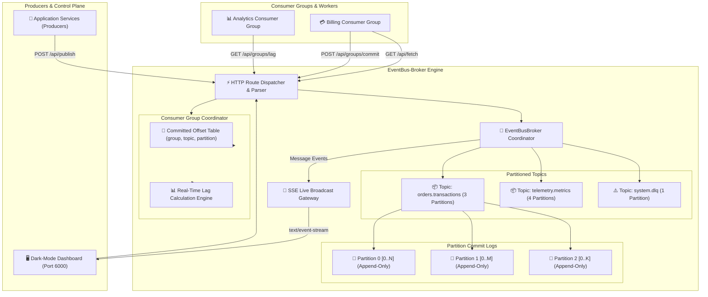

# 🏛️ Technical Architecture Document: EventBus-Broker
**Version:** 2.0.0  
**Domain:** Distributed Event Streaming & Log-Structured Pub/Sub  
**Architect:** 7-Agent SDLC Principal Software Architect  

---

## 1. System Topology & Architecture

---

## 2. Core Architectural Subsystems

### 2.1 `PartitionLog` (`src/engine.js`)
- **Append-Only Array:** Fast $O(1)$ memory appends assigning sequential `offset` indices.
- **High Watermark:** Exposes upper write boundary for consumer fetch verification.
- **Compaction:** Scans backwards to build map of latest keys, discarding historical superseded transitions.

### 2.2 `Topic` (`src/engine.js`)
- Manages $N$ independent `PartitionLog` instances.
- Computes deterministic partition assignment: `hash32(key) % partitionCount`.
- Unkeyed messages cycle through round-robin counters for balanced distribution.

### 2.3 `ConsumerGroup` (`src/engine.js`)
- Stores committed offsets keyed by `topic#partitionId`.
- Computes real-time lag per partition: $\text{HighWatermark} - \text{CommittedOffset}$.

### 2.4 `TopicMatcher` (`src/engine.js`)
- Evaluates AMQP/MQTT style hierarchical topic tokens (`*` and `#`).
- Allows topic pattern querying without regular expression backtracking vulnerabilities.
